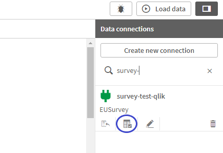

# EUSurvey2Qlik
EUSurvey2Qlik is a Qlik Sense custom data connector for importing responses of surveys created in EUSurvey into a Qlik application, developed by the European Commission's Joint Research Centre (JRC).

* Qlik Sense is a data analytics platform.

* EUSurvey is an open-source surveying tool and is the official online survey management tool of the European Commission. For more information, you can visit https://ec.europa.eu/eusurvey. The source code is available in [GitHub](https://github.com/EUSurvey/EUSURVEY). 

## Prerequisites

### Download and install the latest Qlik Sense Desktop or Qlik Sense Server

Access to a Qlik Sense licence and installation is needed.
* To download the latest version of Qlik sense desktop, you can visit the [Qlik Download Site](https://demo.qlik.com/download/) use the left column to navigate. You can use the desktop (stand-alone) version to debug the connector.
* Also, on this download site, click on **View All/Search** and type in the search bar **QvxSDK**. The QVX (QlikView data eXchange) SDK is the interface used for developing custom connectors. To use the latest **QvxLibray.dll** and **verpatch.exe**, you need to download the most recent SDK. The file to download at the moment of writing this guide is QvxSDK_2.1x64. 
* Qlik Sense Desktop needs a registered Qlik user account. Go to [Qlik Sense Desktop Download](https://www.qlik.com/us/trial/download-qlik-sense-desktop) if you need to create one. The installation is quite simple by following the wizard.

The development was performed and tested using **QvxLibrary.dll v2.1.4.0** and executed within Qlik Sense. QVX SDK can run from within Qlik Sense or QlikView, but the data connector has not been tested within QlikView.

For more information about the QVX SDK, visit:
[Getting started with the QVX SDK](https://help.qlik.com/en-US/qlikview-developer/May2021/Subsystems/QVXSDKAPI/Content/QV_QVXSDKAPI/Getting-started.htm).

### Access to EUSurvey

Access to EUSurvey is needed for viewing survey questions and matching them with the data extracted through the connector.

Ask your EUSurvey administrator for the EUSurvey Web-services API URL and provide you with the system user credentials to access the API. You need this system user to extract the survey responses through the data connector. The system user needs access to the methods prepareResultsXML and getResults. 


### Download and install .NET Framework 4 and Visual Studio

* To download .NET Framework 4, go to the [Microsoft Download Center](https://www.microsoft.com/en-us/download/details.aspx?id=17851). .NET Framework 4 should be installed on any machine using the compiled QVX library for connecting to and reloading data.
* Install Microsoft Visual Studio Community 2019 or above. Only necessary if you want to recompile, modify or debug the data connector code. To download it, please visit [Visual Studio Community](https://visualstudio.microsoft.com/vs/community/) and select to install the .NET desktop development component.
* After downloading .NET Framework 4 and Microsoft Visual Studio, please follow the installation wizard.

## EUSurvey2Qlik installation

1. Download the **bin\Release** folder of the EUSurvey2Qlik data connector.

2. In the file **App.EUSurveyConn.config** update the value of the property **API\_URL\_PROD** with the URL of the EUSurvey Web Services API that you will use.

3. Locate **Qlik connectors folder**, typically "C:\Users\[User]\AppData\Local\Programs\Common Files\Qlik\Custom Data\", "%HOMEPATH%\AppData\Local\Programs\Common Files\Qlik\Custom Data\" or "C:\Program Files\Common Files\Qlik\Custom Data\".

4. Copy the folder **bin\Release** with its content to the **Qlik connectors folder** and rename it, e.g. "QvEUSurveyConnector". 


5. If you want to replace the file **QvxLibrary.dll** with the latest version, you can copy the new file located into Qlik SDK downloaded earlier to the **QvEUSurveyConnector** folder.

6. Copy the folder **web** with its content to the connector folder **QvEUSurveyConnector**.The web folder should look like this:


7. Create the subfolders **output** and **logs**. Give them read and write permissions. These are where the responses of the surveys will be stored in XML format and the connector logs, respectively. The connector folder should look like this:


8. Run the following command to install the connector in Qlik. For more info, see [Making your connector recognizable by Qlik Sense or QlikView](https://help.qlik.com/en-US/qlikview-developer/May2021/Subsystems/QVXSDKAPI/Content/QV_QVXSDKAPI/Making-connector-recognizable-by-QlikView.htm):
```
call .\verpatch .\QvEUSurveyConnector\QvEUSurveyConnector.exe /s "QlikView Connector" "EUSurvey"
```


9. Restart Qlik Sense server or Qlik Sense Desktop. If you skip this step, Qlik might not find the connector. After the restart, the EUSurvey2Qlik connector should appear in the **ConnectorRegistryProxy** log file in "C:\ProgramData\Qlik\Sense\Log\".


10. Check that Qlik Sense server can connect to the EU Survey API host port 443 (Production: https://ec.europa.eu/eusurvey/webservice; Acceptance:https://webgate.acceptance.ec.europa.eu/eusurvey/webservice).

After these steps, the connector is ready to use.


## How to use


### Survey configuration in EUSurvey

Before creating a connection in Qlik Sense, you need to assign some permissions in EUSurvey. Check that you have a **EUSurvey system user with access to the EUSurvey Web Services API**.

1. Log in to EUSurvey and locate your survey and open it.

2. Go to the **Privileges** tab.


3. In the **Privileges** tab, click the button **Add User**. Look for the system user, select it and click OK to add it. 


4. Check that the system user now appears in the privileges list.


5. Click the **Results** circle to edit user rights.


6. Assign the user **Read Access** rights to the **Results** of the survey.


7. Check that the user has now **Read Access**.


8. Take note of the survey **Alias**. The Alias is visible in the **Properties** tab. You will use it in Qlik to create the data connection.


### Creating a data connection in Qlik Sense
### Creating a data connection in Qlik Sense
1. Create/open your application.

2. Within the **Data Load Editor**, click the button **Create new connection** to find the **EUSurvey** data connection below the tab **Data sources**.


3. In the data connection window, enter the **Survey Alias** of the survey you want to see the responses. Also, enter **System User** and **Password** of the EUSurvey user that has read access to the survey results.


4. If you want to extract the data from EUSurvey and update your dataset whenever you load/reload data in your application, click the checkbox **"Extract the data from EUSurvey automatically"**. Conversely, leave it unchecked if you want to use a static dataset that only will be refreshed when manually clicking the "Save and Load Results". It is useful when you need some data to build the data structures and visualizations, but you do not need the data to be up to date.

5. Click the button **Test Connection** to test that you have access to extract data from your survey.


6. Click the button **Save and Load Results** to save the connection and make an initial extraction and load of the survey results. 


Now the connection is ready to use!

### Save and load results step

This last step creates a ticket to download the results through the EUSurvey API's method **prepareResultsXML** and retrieves them through the method **getResults**. 

Sometimes the API is not available to generate the ticket, or the process that prepares the results has not finished yet. When any of these scenarios occurs, the connector calls the respective method several times. You can configure the number of tries in the file  **App.EUSurveyConn.config** by changing the properties **MAX\_PREPARE\_TRIES** and **MAX\_GET\_TRIES**. Also, in the same file, you can configure the number of milliseconds to wait until the next call by setting the property **SLEEP\_TIME**.

AQUIIIII:The connector stores the ticket number in the **tickets.csv** file located in the **output** folder. For each request to **getResults** a new row in the file is added with the alias of the survey, the identifier of the connection that is performing the call, the ticket number assigned, start and end date/time of the call and, a flag that indicates that results were downloaded or not.


After download the results, it creates (if not exists) a folder using the Survey Alias as name to store the results.


Since it can exist several connections to the same survey, the connector creates (if not exists) a subfolder using the connection identifier as name to store the survey responses.


In the connection identifier folder is saved (or replaced) the XML file results.XML that contains the survey responses.


An example of the results.XML file is available [here](doc/survey-test-qlik/result.xml).

### Using a data connection in Qlik Sense
1. Click the select data button in the data connection created in the steps before.



2. It opens a window that allow you to navigate through the data extracted. The database name is the alias of the survey in EUSurvey. In the Schema dropdown you can select **Responses** to see the survey's results or **Metadata** to see the possible answers of the selection questions, matrices and tables of the survey. 


2.1. Select the **Responses** option to see the survey results.


2.1.1. The connector creates a **Main table** with the responses for the **single answer questions** (i.e. free text, single choice, number-slider, date, time, e-mail, regular expression, rating and file upload). In the Main table each question is a column and each row is a survey contribution. For the **multiple answer question** (i.e. multiple choice, gallery, matrix and table) the connector creates a table for each question.


2.2. It is also possible to select the **Metadata** schema to see the possible answers of the questions created in the survey.


Please note that the connector gives a name of 25 characters to each EU-Survey field. 
The name starts with the id of the field (which is by default something like "IDx", where X is the number of field), and is filled in up to 25 chars with the beginning of the question in EU-Survey.
Blanks are filled in with underscores, whereas underscores at the end of the ID names are ignored.
Therefore, here you have a tip: name the EU-Survey field with the wished names in Qlik with a sufficient name (at least to arrive to 25 chars) of underscores at the end.
For example: DOMAIN_________________________________ --> this will produce in Qlik the field "DOMAIN".

2.2.1. The connector creates a **Main metadata table** that contains possible answers of all single choice questions. Each row in the Main Metadata table is a possible answer. For the **multiple answer question**, it creates a table containing possible answers for each question of this type.


3. After selecting the data you want to use, click the button "Insert script" to generate the load script. At east one table and column has to be selected.

4. Click the button **Load data** to load the data into the Qlik application. If you have checked the checkbox **Extract the data from EUSurvey automatically** before in the connection properties the survey data will be refreshed.

## Data structures and nomenclature

### Database
The name of the database is the Alias of the survey loaded.


### Schema
In the Schema dropdown you can select **Responses** to see tables associated to the survey's results or **Metadata** to see tables that have possible answers of selection questions, matrices and tables of the survey. 


* All the tables that belong to the **Responses** schema have as **prefix** the first three characters of the survey alias and the character '\_', **e.g. sur\_** if the alias is survey-test-qlik. 
* All the tables that belong to the **Metadata** schema have as **prefix** the character '\_' followed by the first three characters of the survey alias and the character '\_', **e.g. \_sur\_** if the alias is survey-test-qlik. 


### Table and field names
The table name is compund by the schema prefix and:
* The word **Main** for the main survey table, **e.g. sur\_Main** or **\_sur\_Main**. 
  * The **Main responses table**, **e.g. sur\_Main**, has the responses for the **single answer questions** (i.e. free text, single choice, number-slider, date, time, e-mail, regular expression, rating and file upload).  Each question is a column and each row in this table is a set of answers of a participant in the survey. 
  * Alternatively, the **Main metadata table**, **e.g. \_sur\_Main**, contains possible answers of all single choice questions. Each row in this table is a possible answer of a single choice question.
* The **question identifier**, e.g. ID5 and the **question text**, e.g. "Please select all options that apply", for **Question tables**. 
  * A question table is created for each **multiple answer question** (i.e. multiple choice, gallery, matrix and table). Note that this table can have more than one row by participant. Blank spaces of the question text are replaced by "\_" and special characters are removed from the table name. The table name is truncated to 32 characters. **E.g. sur\_ID5\_Please\_select\_all\_opt or \_sur\_ID5\_Please\_select\_all\_opt**. 
  * **Question responses tables** have the answers of all participants of a specific question.
  * Alternatively, **Question metadata tables** have possible answers of a specific question.

All field names associated with a question start with the question identifier followed by a '\_' and the text of the question. Blank spaces of the question text are replaced by "\_" and special characters are removed from the field name. The field name is truncated to 25 characters. 

Exceptions: 
* If the survey alias begins with a number, the first character of the table name will be a "T", since Qlik does not allows to have table names starting with numbers. 
* If the question identifier field in EUSurvey is empty, an identifier will be generated by the connector starting with "P" and following by a number that indicates the position of the question in the XML file sorted by document order.

The question identifier can be found when you open the survey in edit mode and click the question to see the "Element Properties" and click again to display the "Advanced" properties:

  

### Main table structure

* **Main responses table**  
  * Contribution\_ID: the unique identifier of a contribution to the survey. A contribution is the set of responses of a survey partipant.
  * Contribution info fields:
    * Invitation\_ID: the unique identifier of the invation sent. 
    * User\_Name: The email of the participant to which the invitation was sent.
    * Survey\_Alias: alias of the survey.
    * Extraction\_Date: date of extraction of the data using the data connector.
    * Creation\_Date: date of creation of the contribution to the survey.
    * Modification\_Date: date of last update of the contribution to the survey.
    * Language: language of the survey answered as ISO 639-1 language code.
    * List: the related Guest List ID if existing
  * \<question identifier\>\_\<question text\>: for each single answer question (i.e. free text, single choice, number-slider, date, time, e-mail, regular expression, rating and file upload) a corresponding field is included in this table.
  
* **Main metadata table**
    * Language: Language of the possible answer.
    * \<question identifier\>\_\<question text\>: for each single choice question a corresponding field is included in this table with its possible answers.
  
 ### Question table structure
 
 * **\<question identifier\>\_\<question text\> responses tables**
    * Contribution_ID: the unique identifier of a contribution to the survey.
    * \<question identifier\>\_\<question text\>: this field has the answer of the participant to the question. If the participant has selected more than one option for the specific question, the table will have many rows as answers has selected the particpant.
    * Answer: Used only in multiple choice matrix questions and table questions. It has the name of the row of the matrix/table.
    
* **\_\<question identifier\>\_\<question text\> metadata tables**
  * Language: Language of the possible answer.
  * \<question identifier\>\_\<question text\>: for each multiple answer question a corresponding field is included with its possible answers.
  * Possible\_values: for each matrix or table question a field is included with its possible answers/rows.
### Type of questions and qlik tables 

| Question group | Question type | Main responses table | Main metadata table | Question responses table | Question metadata table |
| ------------- | ------------- | ------------- | ------------- | ------------- | ------------- | 
| Single answer | Free text | X |  | ||
| Single answer | Single choice | X | X|||
| Single answer | Number-slider | X |  |||
| Single answer | Date | X | |||
| Single answer| Time | X | |||
| Single answer | E-mail | X | |||
| Single answer | Regular expression | X | |||
| Single answer | Rating | X | |||
| Single answer | File upload | X | |||
| Multiple answer  | Multiple choice |  | |X|X|
| Multiple answer  | Gallery|  | |X||
| Multiple answer  | Matrix single/multiple choice |  | |X|X|
| Multiple answer  | Table|  | |X|X|


## EUSurvey to Qlik transformation examples

In this section you will find examples of EUSurvey question types and how they are represented in Qlik Sense after retrieving the data, transforming and loading into a Qlik application. A PDF of the survey contribution used in the following examples is available [here](doc/survey-test-qlik/Contribution0781ce81-7a76-4138-8aeb-e16543622406.pdf) and the results.XML file is available [here](doc/survey-test-qlik/result.xml).

### 1. Main table

1.1. **Contribution info fields**

Qlik

* Schema: Responses; Table name: sur_Main

| Contribution\_ID  |Invitation\_ID| User\_Name| Survey\_Alias|Extraction\_Date|Creation\_Date|Modification\_Date|Language|List|
| ------------- | ------------- | ------------- | ------------- | ------------- | ------------- | ------------- | ------------- | ------------- |
| 0781ce81-7a76-4138-8aeb-e16543622406  | 0781ce81-7a76-4138-8aeb-e16543622406 |  | survey-test-qlik  | 2021-11-05 12:59:28 PM |  2021-11-04 15:00:32 | 2021-11-04 15:00:32  | EN  | 26318127  |
| c5c95415-82fc-4077-ac5c-dac171e9f3a7  | c5c95415-82fc-4077-ac5c-dac171e9f3a7  |my.email@ext.ec.europa.eu |survey-test-qlik  |2021-11-05 12:59:28  |2021-11-04 15:47:47 | 2021-11-04 15:47:47   | EN | 26318622  |
| ... | ... | ... | ... | ... |...| ... | ...| ... |

1.2. **Free text question**

EUSurvey

* Question identifier: [IDF1]


Qlik

* Schema: Responses; Table name: sur_Main

| Contribution\_ID  |Contribution info fields...| IDF1\_Please\_enter\_your\_fr | Other single answer questions...|
| ------------- | ------------- | ------------- | ------------- |
| 0781ce81-7a76-4138-8aeb-e16543622406  |... | This is my free text  | ...  | 
| ... | ... | ... | ... |

1.3. **Single choice question**

EUSurvey

* Question identifier: [IDF2]


* Question identifier: [ID37]


Qlik

* Schema: Responses; Table name: sur_Main

| Contribution\_ID  |Contribution info fields...| IDF2\_Please\_enter\_which\_o | ID37\_EU\_agencies\_question |Other single answer questions...|
| ------------- | ------------- | ------------- | ------------- | ------------- |
| 0781ce81-7a76-4138-8aeb-e16543622406  |... | Second  |  |...  | 
| ... | ... | ... | ... |... |

Note that in the EU Agencies question no selection was made. Therefore, the contribution '0781ce81-7a76-4138-8aeb-e16543622406' has an empty string ('') in the field ID37\_EU\_agencies\_question.


* Schema: Metadata; Table name: \_sur_Main

| Language |IDF2\_Please\_enter\_which\_o| ID37\_EU\_agencies\_question | Other single answer questions...|
| ------------- | ------------- | ------------- | ------------- |
| EN | First | | | 
| EN | Second | | |
| EN |  | Agency for Support for BEREC | |
| EN |  | Agency for the Cooperation of Energy Regulators | |
| EN |  | Authority for European Political Parties and European Political Foundations | |
| EN |  | Community Plant Variety Office| |
| ... |  | ... | ... |


1.4. **Number-slider question**

EUSurvey

* Question identifier: [ID8]


* Question identifier: [ID9]


Qlik

* Schema: Responses; Table name: sur_Main

| Contribution\_ID  |Contribution info fields...| ID8\_Number\_Slider\_Questio| ID9\_Number\_Slider\_Questio | Other single answer questions...|
| ------------- | ------------- | ------------- | ------------- | ------------- |
| 0781ce81-7a76-4138-8aeb-e16543622406  |... | 4.0 |5000.0  | ...  | 
| ... | ... | ... | ... |... |

1.5. **Date and time questions**
EUSurvey

* Question identifier: [ID10]


* Question identifier: [ID11]


Qlik

* Schema: Responses; Table name: sur_Main

| Contribution\_ID  |Contribution info fields...| ID10\_Date| ID11\_Time | Other single answer questions...|
| ------------- | ------------- | ------------- | ------------- | ------------- |
| 0781ce81-7a76-4138-8aeb-e16543622406  |... | 2021-12-04 |07:00:00  | ...  | 
| ... | ... | ... | ... |... |

1.6. **E-mail question**

EUSurvey

* Question identifier: [ID30]


Qlik

* Schema: Responses; Table name: sur_Main

| Contribution\_ID  |Contribution info fields...| ID30\_Email | Other single answer questions...|
| ------------- | ------------- | ------------- | ------------- |
| 0781ce81-7a76-4138-8aeb-e16543622406  |... | valid@email.com  | ...  | 
| ... | ... | ... | ... |

1.7. **Regular expression question**

EUSurvey

* Question identifier: [ID31]


Qlik

* Schema: Responses; Table name: sur_Main

| Contribution\_ID  |Contribution info fields...| ID31\_RegEx\_Question\_only| Other single answer questions...|
| ------------- | ------------- | ------------- | ------------- |
| 0781ce81-7a76-4138-8aeb-e16543622406  |... | abcde  | ...  | 
| ... | ... | ... | ... |

1.8. **Rating question**

EUSurvey

* Question identifier: [ID34]
  * Subquestion 'Rate question 1' identifier: [ID390]
  * Subquestion 'Rate question 2' identifier: [ID391]


Qlik

* Schema: Responses; Table name: sur_Main

| Contribution\_ID  |Contribution info fields...| ID390\_Please\_rate\_the\_fol| ID391\_Please\_rate\_the\_fol| Other single answer questions...|
| ------------- | ------------- | ------------- | ------------- | ------------- |
| 0781ce81-7a76-4138-8aeb-e16543622406  |... | 7/7|1/7  | ...  | 
| ... | ... | ... | ... |


1.9. **File upload question**

EUSurvey

* Question identifier: [ID393]


Qlik

* Schema: Responses; Table name: sur_Main

| Contribution\_ID  |Contribution info fields...| ID393\_Please\_upload\_your| Other single answer questions...|
| ------------- | ------------- | ------------- | ------------- |
| 0781ce81-7a76-4138-8aeb-e16543622406  |... | atardecer-en-el-avila.jpg  | ...  | 
| ... | ... | ... | ... |

Note: the data connector when retrieves the results of the survey also downloads all the files uploaded by the participants, everything comes in an ZIP file, but since we do not need them in Qlik Sense, the connector does not extract them from the ZIP file and deletes the ZIP file. 

If you want the files uploaded along with the results, you can uncomment the following line from the EUSurveyHelper.cs:
```
            //ZipFile.ExtractToDirectory(this.outputZip, this.outputDirSurvey);
```

And comment the lines in the same file:

```
            // This code is to extract the result.xml only from the zip
            using (ZipArchive archive = ZipFile.OpenRead(this.outputZip))
            {
                foreach (ZipArchiveEntry entry in archive.Entries)
                {
                    if (entry.FullName.EndsWith(surveySettings["RESULT_XML_FILE"], StringComparison.OrdinalIgnoreCase))
                    {
                        // Gets the full path to ensure that relative segments are removed.
                        string destinationPath = Path.GetFullPath(Path.Combine(outputDirSurvey, entry.FullName));

                        // Ordinal match is safest, case-sensitive volumes can be mounted within volumes that
                        // are case-insensitive.
                        if (destinationPath.StartsWith(outputDirSurvey, StringComparison.Ordinal))
                            entry.ExtractToFile(destinationPath);
                    }
                }
            }
```

### 2. Question tables
2.1. **Multiple choice**

EUSurvey

* Question identifier:[ID5]


Qlik 

* Schema: Responses; Table name: sur_ID5_Please_select_all_option

| Contribution\_ID  |ID5_Please_select_all_opt|
| ------------- | ------------- | 
| 0781ce81-7a76-4138-8aeb-e16543622406  |Answer 1 |
| 0781ce81-7a76-4138-8aeb-e16543622406  |Answer 2 |
| ... | ... |

* Schema: Metadata; Table name: \_sur\_ID5\_Please\_select\_all\_option

| Contribution\_ID  |\_sur\_ID5\_Please\_select\_all\_option|
| ------------- | ------------- | 
| EN  |Answer 1 |
| EN  |Answer 2 |
| EN  |Answer 3 |
| EN  |Answer 4 |

2.2. **Gallery questions**

EUSurvey

* Question identifier:[ID32]


Qlik 

* Schema: Responses; Table name: sur_ID32_Gallery_question

| Contribution\_ID  |ID32_Gallery_question|
| ------------- | ------------- | 
| 0781ce81-7a76-4138-8aeb-e16543622406  |0 |
| 0781ce81-7a76-4138-8aeb-e16543622406  |1 |
| ... | ... |

The numbers in the ID32_Gallery_question column correspond to the image position within the gallery. Nevertheless, sometimes answers to gallery questions correspond to the title of the image selected. It is unknown to me when the responses correspond to the image position or the image title. The connector picks up whichever the results.xml file has. In the case of image titles, the table would be like this one:

| Contribution\_ID  |ID32_Gallery_question|
| ------------- | ------------- | 
| 0781ce81-7a76-4138-8aeb-e16543622406  |Halloween |
| 0781ce81-7a76-4138-8aeb-e16543622406  |Thanksgiving |
| ... | ... |

There is no metadata table for gallery questions since their list of possible answers are not available in the results.xml file.

2.3. **Single choice matrix questions**


EUSurvey

* Question identifier: [ID12]
  * Subquestion 'Question 1' identifier: [ID17]
  * Subquestion 'Question 2' identifier: [ID18]
  * Subquestion 'Question 3' identifier: [ID19]


Qlik 

* Schema: Responses; Table name: sur_ID12_Single_choice

| Contribution\_ID  |ID17_Question_1 | ID18_Question_2 | ID19_Question_3 |
| ------------- | ------------- | ------------- | ------------- | 
| 0781ce81-7a76-4138-8aeb-e16543622406  |Answer 1 |Answer 2 |Answer 3 |
| ... | ... | ... | ... |

* Schema: Metadata; Table name: \_sur_ID12_Single_choice

| Contribution\_ID  |Possible_Values|
| ------------- | ------------- | 
| EN  |Answer 1 |
| EN  |Answer 2 |
| EN  |Answer 3 |

2.4. **Multiple choice matrix questions**

EUSurvey


* Question identifier: [ID379]
  * Subquestion 'Question 1' identifier: [ID384]
  * Subquestion 'Question 2' identifier: [ID385]
  * Subquestion 'Question 3' identifier: [ID386]


Qlik 

* Schema: Responses; Table name: sur_ID379_Matrix_multiple_choice

| Contribution\_ID  | Answer |ID384_Question_1 | ID385_Question_2 | ID386_Question_3 |
| ------------- | ------------- | ------------- | ------------- | ------------- | 
| 0781ce81-7a76-4138-8aeb-e16543622406  |Answer 1 | Y| Y | Y |
| 0781ce81-7a76-4138-8aeb-e16543622406  |Answer 2 | Y| Y | N |
| 0781ce81-7a76-4138-8aeb-e16543622406  |Answer 3 | Y| N | N |
| ... | ... | ... | ... | ... |

* Schema: Metadata; Table name: \_sur_ID379_Matrix_multiple_choice

| Contribution\_ID  |Possible_Values|
| ------------- | ------------- | 
| EN  |Answer 1 |
| EN  |Answer 2 |
| EN  |Answer 3 |


2.5. **Table questions**

EUSurvey

* Question identifier:[ID20]
  * Subquestion 'Row 1' identifier: [ID387]
  * Subquestion 'Row 2' identifier: [ID388]
  * Subquestion 'Row 3' identifier: [ID389]
  


Qlik 

* Schema: Responses; Table name: sur_ID20_Table

| Contribution\_ID  | Answer |ID387_Row_1 | ID388_Row_2 | ID389_Row_3 |
| ------------- | ------------- | ------------- | ------------- | ------------- | 
| 0781ce81-7a76-4138-8aeb-e16543622406  |A | 1| a | Hello |
| 0781ce81-7a76-4138-8aeb-e16543622406  |B | 2| b | Hola |
| 0781ce81-7a76-4138-8aeb-e16543622406  |C | 3| c | Ciao |
| ... | ... | ... | ... | ... |

* Schema: Metadata; Table name: \_sur_ID20_Table

| Contribution\_ID  |Possible_Values|
| ------------- | ------------- | 
| EN  |A |
| EN  |B |
| EN  |C |

## Changes to the survey structure after the first load in Qlik

| Change performed in EUSurvey | Change caused in Qlik Sense after reloading data|
| ------------- | ------------- | 
| New question added  |  The new question will appear in the database |
| Question identifier/text modified  | The old identifier/text will be replaced by the new one. The field name/table name will change. Qlik data model will need some adjustments. |
| Question deleted  | The field/table will be deleted from the database. Qlik data model will need some adjustments. |
| New possible answer added to a single/multiple choice question  |  The new value will appear in its corresponding metadata table and if it is selected by a participant, will appear also in its corresponding response table |
| Possible answer modified in a single/multiple choice question  |  The new value will replace the old one. VERIFY THIS |
| Possible answer deleted from a single/multiple choice question  | It will be removed from its corresponding metadata table and the responses that had this value will be replaced by an empty string i.e. ''|
| New row added to matrix/table||
| Row text modified in a matrix/table||
| Row deleted from matrix/table||
| New contribution| The new contribution will appear in the responses tables|
| Changes to a contrubition	| The contribution is also updated in the responses tables|
| Delete contribution	| The contribution will be deleted from all the responses tables|


## Limitations 
* The data connector reads the question texts and pre-defined values in the pivot langaguage of the survey. So if the survey was answered in multiple languages, all the responses of single/multiple choice questions and matrix questions will be shown in the pivot language.
* The number of calls to the EUSurvey API is limited to 5,000 calls per user, per day.
* There has not been developed any script to clean the output folder of the data connector regularly. In this folder XML files of the surveys are stored, so it could be a good practice to delete the XML files of unused connections.
 
## Compilation
1. Open Microsoft Visual Studio (Microsoft Visual Studio Community 2019 or above).
2. Open the C# console project "QvEUSurveyConnector.sln" in Visual Studio
3. Check that the references to the libraries "QvxLibrary.dll" and "log4net" are correct.
4. Compile the project by clicking the menu option "Build>Rebuild Solution" to clean the solution and then compile and builds all project files and components. 
5. Follow the installation steps mentioned before to install/update the connector in Qlik. If the connector is already installed and you only need to update the connector, you can delete the files in the Qlik connector folder "QvEUSurveyConnector" and repeat the installation steps 3 to 6.

## License
